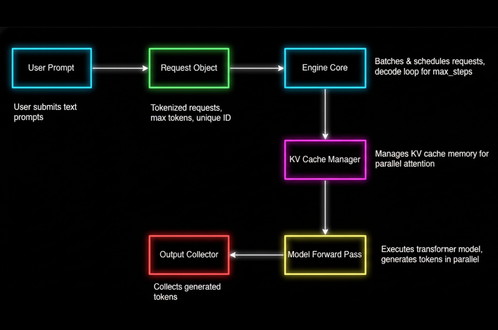

# Building a High-Throughput LLM Inference System: A vLLM-inspired Approach

This project implements a LLM inference engine focused on high-throughput batch processing and KV cache management. 
  

<p align="center">
  <em>System architecture showing engine core, KV cache manager, and batched decoder modules.</em>
</p>


## Implemented vLLM Components:
- **Engine Core:** Synchronous engine that efficiently queues and processes multiple prompts in parallel.
  
- **KV Cache Manager:** Allocates and reuses transformer key-value memory blocks for fast attention computation.
  
- **Continuous Batching:** Schedules new requests into the active batch immediately after others finish, maximizing GPU utilization by maintaining a high, non-stop flow of work.

# Results


<p align="center">
  Throughput and Speedup Across Batch Sizes, Prompt Lengths, and Output Lengths. </br>
  Each plot visualizes the total tokens generated and batching efficiency compared to the naive baseline.
</p>

## Throughput & Speedup
- **Average throughput improvement (speedup): 2x – 10x** across most realistic settings (batch sizes 4–8, max_tokens 16–32).

- **Maximum observed speedup:** 43x for small prompt/large batch/long output scenarios.

- **Typical speedup: 2x – 7x** for batch sizes 4–8 and outputs of 16–32 tokens.

- **Throughput is maximized** for large max_tokens and batch sizes.

- **Latency increases** for the largest jobs, but bulk inference benefits heavily from batching.

## Representative Benchmark Results

| PromptLen | BatchSize | MaxTokens | OptTokens | NaiveTokens | Speedup |
|-----------|-----------|-----------|-----------|-------------|---------|
| 8         | 1         | 64        | 961       | 22          | 43.68   |
| 8         | 8         | 64        | 1321      | 460         | 2.87    |
| 32        | 8         | 64        | 2826      | 387         | 7.30    |
| 64        | 4         | 64        | 3627      | 256         | 14.17   |
| 128       | 4         | 64        | 1312      | 210         | 6.25    |
| 128       | 8         | 64        | 2130      | 388         | 5.49    |

- OptTokens and NaiveTokens show the total number of output tokens generated by the optimized (batched) and naive (sequential) engines, respectively, for each setting.

- Speedup is the ratio of optimized to naive throughput, indicating how much batching improves efficiency.

# Usage

## 1. Install dependencies:
```
pip install torch matplotlib numpy
```

## 2. Run the benchmark:
```
python main.py
```
All benchmark results will be printed as a table, and plots saved to plots/benchmark_grid.png.


